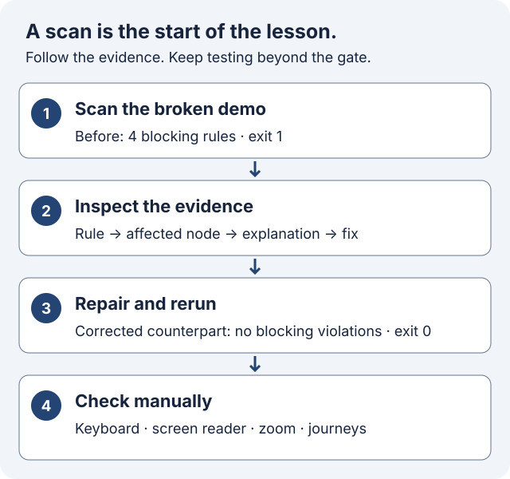

<div align="center">

# axe-check
### Find the barrier. Understand the fix.

A one-file accessibility CLI and a hands-on lab for learning how to turn automated findings into better web experiences.

[**Start the learning lab →**](examples/README.md) · [Quick start](#quick-start) · [CLI options](#options) · [Output contract](#output-contract)

[](LICENSE)
[](package.json)

</div>

---

Scan one URL with **Playwright Chromium + axe-core**. Read a terminal summary, keep the JSON evidence, repair the page, and rerun. By default, WCAG 2.1 A/AA rule tags are selected and serious or critical violations block the run.

**A passing automated gate is evidence, not proof of WCAG conformance.** The lab teaches both the repairs axe can identify and the keyboard behavior it can miss.

## What you can do

- **Learn by repairing:** paired broken and corrected pages, with four intentional blocking rules.
- **Inspect useful evidence:** rule IDs, affected nodes, failure explanations and help links in JSON.
- **Choose a gate:** impact thresholds, repeatable scope selectors, rule tags and optional strict review.
- **Read the whole implementation:** the CLI lives in [one file](axe-check.mjs), with [local regression tests](test/cli.test.mjs).

## Quick start

Use **Node.js 20 or newer** (a currently supported LTS release is recommended) and npm. Clone this repository; the package is private and is not published to npm.

```sh
git clone https://github.com/bg-playground/axe-check.git
cd axe-check
npm ci
npx playwright install chromium
node axe-check.mjs https://example.com
```

On Linux CI, use `npx playwright install --with-deps chromium` to install browser system dependencies too. `npm ci` uses the committed lockfile; install Chromium again after updating Playwright.

## Hands-on learning



**[Open the step-by-step lab →](examples/README.md)**

1. **Scan** [the deliberately inaccessible page](examples/inaccessible.html). The lab provides a command that works in PowerShell and POSIX shells using an absolute file URL. Expect exit **1**.
2. **Inspect** `demo-before.json`: connect each rule's `nodes`, `failureSummary` and `helpUrl` to the markup.
3. **Repair** a practice copy: meaningful map text, a visible input label, a named button and readable hint contrast. Compare [the corrected counterpart](examples/accessible.html).
4. **Rerun**, then **test manually**. The four scan repairs can produce exit **0** while the clickable div still lacks keyboard behavior. Finish the native-button, disclosure-state and feedback repairs described in the lab.

Both examples are local teaching pages; no booking or email is sent. After dependencies and Chromium are installed, the demo scan needs no server or external website.

### What the terminal tells you

Illustrative excerpts from the lab's stderr summaries; file URL prefixes and rule ordering can vary. The failing excerpt omits individual rule details. The committed tests expect four blocking rules before repair and empty finding arrays in the corrected counterpart.

**Before — intended failure, exit 1**

```text
file:///…/examples/inaccessible.html: 4 blocking rule(s)
```

The four rules are `image-alt`, `label`, `button-name` and `color-contrast`.

**After — configured gate passes, exit 0**

```text
file:///…/examples/accessible.html: no blocking violations
```

With `--out`, the report goes to your file and stdout stays empty. Without it, stdout contains JSON. Counts describe **rules**, not elements. Exit 0 can still retain below-threshold violations or non-strict incomplete findings: always inspect the report. See the [output contract](#output-contract) for all four exit codes.

## Examples

Keep the JSON report and read the human summary in your terminal:

```sh
node axe-check.mjs https://example.com --out axe-report.json
```

Scan a section after it becomes visible, exclude a widget, and change the failure threshold:

```sh
node axe-check.mjs https://example.com --include '#main' --exclude '#chat' --wait-for '#main' --fail-on moderate
```

Include multiple sections and replace the default rule tags:

```sh
node axe-check.mjs https://example.com --include '#header' --include '#main' --tags wcag2a,wcag2aa --tags wcag21a,wcag21aa,wcag22aa
```

Require a review of incomplete findings:

```sh
node axe-check.mjs https://example.com --strict-review --timeout 60000 --out axe-report.json
```

You can also pass an absolute `file:` URL for a local HTML page. A filesystem path alone is not a URL. To try a bundled fixture on any platform:

```sh
node --input-type=module -e "import { pathToFileURL } from 'node:url'; import { resolve } from 'node:path'; console.log(pathToFileURL(resolve('fixtures/contrast.html')).href)"
# Pass the printed URL to node axe-check.mjs.
```

## Options

| Flag | Default | Meaning |
| --- | --- | --- |
| `--include` | whole page | Include selector; repeatable |
| `--exclude` | none | Exclude selector; repeatable |
| `--fail-on` | `serious` | Minimum blocking impact: `minor`, `moderate`, `serious`, or `critical` |
| `--wait-for` | `body` | Selector that must become visible after navigation |
| `--tags` | `wcag2a,wcag2aa,wcag21a,wcag21aa` | Repeatable or comma-separated axe rule tags; replaces the defaults |
| `--strict-review` | off | Fail on incomplete findings when no violations block |
| `--timeout` | `30000` | Positive safe integer in milliseconds, applied separately to navigation and selector waiting |
| `--out` | stdout | Write JSON to this file; parent directory must exist; existing file is overwritten |
| `--help`, `-h` | | Print usage to stderr and exit successfully |

Pass exactly one absolute `http:`, `https:`, or `file:` URL. Unknown flags, missing or blank values, invalid thresholds, invalid timeouts, extra URLs and empty tag entries fail before Chromium starts. Selectors and tag applicability are evaluated by Playwright/axe during the scan. Use axe's documented rule tags; a tag selection can leave no applicable rules.

Scope follows axe semantics. When excluding content inside an explicitly included container, target the offending descendants directly rather than including and excluding the same container. Excluded content and rules outside your selected tags are not assessed.

## Output contract

A completed scan produces one JSON object, followed by a newline, on **stdout**. With `--out`, stdout is empty and JSON goes to that file. Summaries, incomplete-rule details, help and errors go to **stderr**. Reports are still produced for exit codes `1` and `3`.

| Field | Meaning |
| --- | --- |
| `url` | Requested URL, before redirects |
| `tags` | Effective rule tags |
| `failOn` | Blocking impact threshold |
| `waitFor` | Visibility selector |
| `strictReview` | Whether incomplete findings fail the run |
| `violations` | **All** axe violations in the selected scope, including those below the threshold |
| `blockingViolations` | Subset of `violations` at or above `failOn` |
| `incomplete` | Axe findings requiring manual review |

Rule objects retain axe's details, including rule IDs, impact, help links and affected nodes. An unknown/null impact is retained in `violations` but does not meet a blocking threshold. Arrays count rules, not affected elements. Passed and inapplicable rules are not included in this compact report.

**Compatibility note:** older reports used `violations` for only the blocking subset. Consumers that used that field to decide whether to fail should now read `blockingViolations` or use the process exit code.

| Exit code | Meaning |
| --- | --- |
| `0` | No blocking violations and no strict-review failure; also `--help` |
| `1` | At least one blocking violation; takes precedence over incomplete findings |
| `2` | Argument, browser, navigation, HTTP 400+, selector, scan or report-write error |
| `3` | `--strict-review` is enabled, incomplete findings exist, and no violation blocks |

Exit `2` does not promise a report. Remove stale report files before a CI run if you collect artifacts on errors. A clean exit means the configured gate passed; below-threshold findings can still exist. Read the report and review any incomplete rules.

## CI integration

This repository's [CI workflow](.github/workflows/ci.yml) runs the local fixture tests on Node 20, 22 and 24. It needs no external website.

To gate a deployed preview in your own GitHub Actions workflow, run the CLI against that preview's URL. This example assumes axe-check is checked out as the working directory; replace the example URL with your preview:

```yaml
permissions:
  contents: read
jobs:
  accessibility:
    runs-on: ubuntu-latest
    steps:
      - uses: actions/checkout@v4
      - uses: actions/setup-node@v4
        with:
          node-version: 24
          cache: npm
      - run: npm ci
      - run: npx playwright install --with-deps chromium
      - name: Scan preview
        run: node axe-check.mjs https://example.com --out axe-report.json
      - uses: actions/upload-artifact@v4
        if: always()
        with:
          name: axe-report
          path: axe-report.json
          if-no-files-found: ignore
```

The scan step fails naturally on nonzero exit codes; artifact upload still runs. For a local application, start its server and wait until it is ready before scanning. Use `--strict-review` only when your team intends to block builds pending review.

## Development and tests

```sh
npm ci
npx playwright install chromium
npm test
# Original targeted contrast regression:
npm run test:contrast
```

The CLI integration suite serves static HTML on an ephemeral loopback port and also scans a local file. It checks exit codes 0/1/2/3, threshold retention, strict-review precedence, stdout/stderr separation, file output, repeatable options, early argument errors, HTTP errors, selector failures and write errors. The contrast regression confirms that the failing color pair is flagged and the passing pair stays clean. Chromium must be installed to run these tests.

## Limits: one page state, plus human judgment

This is one scan of one rendered page in a fresh, headless Chromium context. It waits for DOM content and a visible selector, then runs axe. It does not crawl routes, sign in, click through interactions, test every responsive layout, or guarantee that asynchronous content has finished loading. Choose a meaningful `--wait-for` selector for dynamic pages. The timeout is not a deadline for the entire scan.

Automated findings do **not** establish WCAG conformance or replace human evaluation. Test keyboard navigation, focus order, screen-reader behavior, meaningful alternative text, error handling, zoom/reflow and complete user journeys manually. Incomplete findings are requests for review, not confirmed violations; background images can make contrast impossible for axe to determine. Pair this CLI with manual accessibility testing and feedback from people with disabilities.

## License

[MIT](LICENSE).
